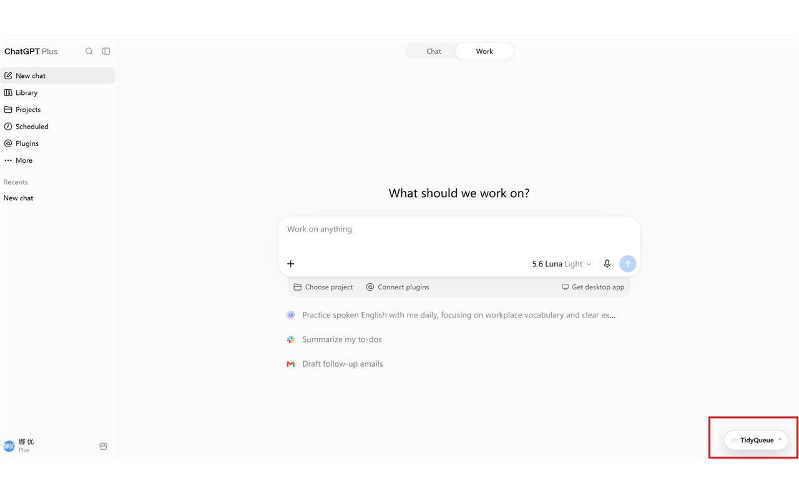
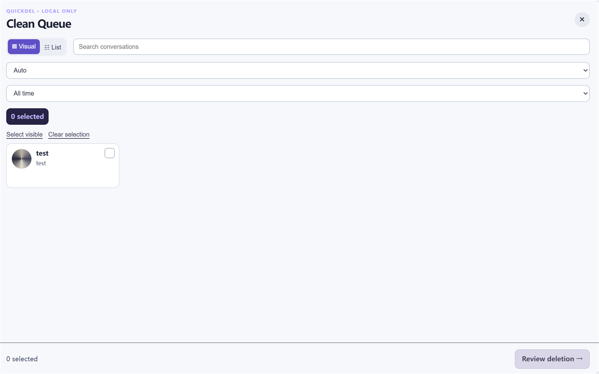
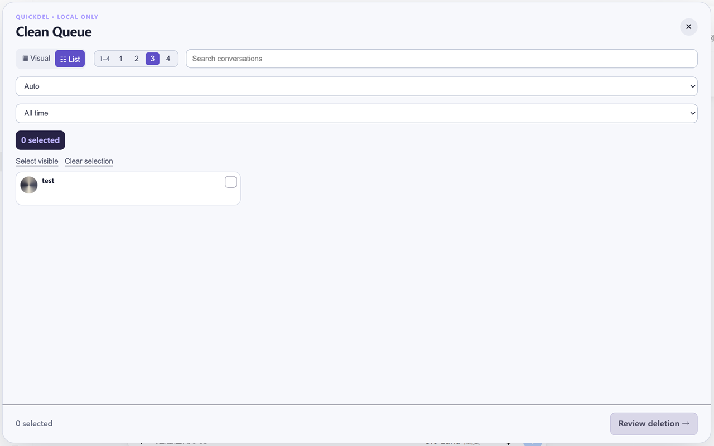
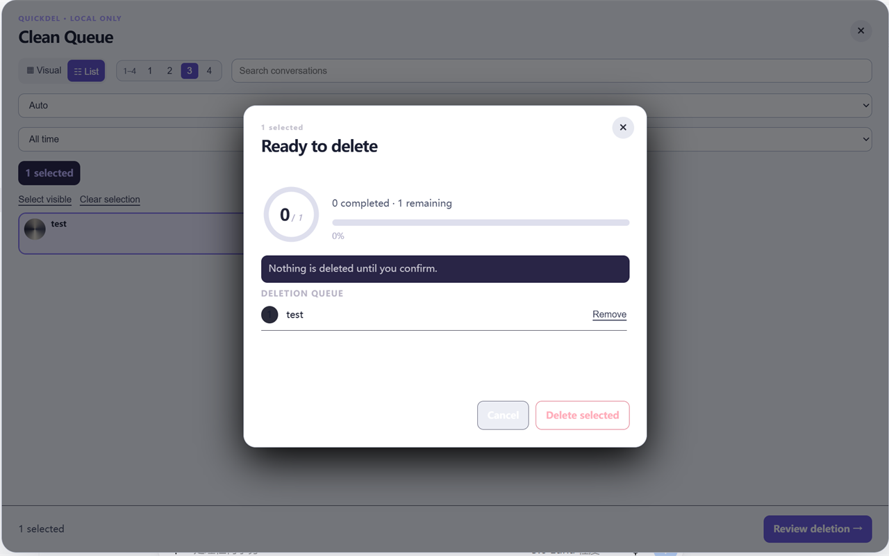

# TidyQueue

**Web AI Chat Cleanup** — a local-only Chrome extension for reviewing and deleting your own ChatGPT or Gemini conversations with confidence.

TidyQueue turns a crowded supported AI-chat sidebar into a clear, reviewable cleanup workflow. Browse conversations visually, select exactly what you mean to remove, inspect the deletion queue, and confirm before any deletion starts.

> TidyQueue is independent software and is not affiliated with or endorsed by OpenAI, ChatGPT, Google, or Gemini.

## Why install TidyQueue?

- **See your history clearly.** Switch between a visual card view and a compact list view, search conversations, and filter by age.
- **Select faster.** Use **Ctrl** (or **Command** on macOS) to work with individual selections, or hold **Shift** to select a continuous range of visible conversations.
- **Delete with a review step.** Nothing is deleted until you inspect the queue and explicitly confirm it.
- **Keep data local.** No account system, analytics, remote service, or persistent conversation metadata.

## See it in action

<table>
  <tr>
    <td width="50%" valign="top">
      <strong>Open from any ChatGPT tab</strong><br>
      TidyQueue stays available as a compact local launcher in the lower-right corner.
      <br><br>
      
    </td>
    <td width="50%" valign="top">
      <strong>Visual selection</strong><br>
      Browse conversation cards and select multiple conversations before taking action.
      <br><br>
      
    </td>
  </tr>
  <tr>
    <td width="50%" valign="top">
      <strong>Compact list view</strong><br>
      Use list density controls when you want to scan more conversations at once.
      <br><br>
      
    </td>
    <td width="50%" valign="top">
      <strong>Review before deletion</strong><br>
      Confirm the exact deletion queue and remove any item before deletion begins.
      <br><br>
      
    </td>
  </tr>
</table>

## Safety and privacy

- TidyQueue runs only on `chatgpt.com`, `chat.openai.com`, and `gemini.google.com/app`.
- Conversation titles, selected items, and queue state stay only in the current tab's memory.
- Deletion requires an explicit review-and-confirm step.
- The DOM adapter pauses rather than continuing if ChatGPT controls are missing or changed.

Read the full [TidyQueue Privacy Policy](./PRIVACY_POLICY.md).

## Install from the Chrome Web Store

Install [**TidyQueue** from the Chrome Web Store](https://chromewebstore.google.com/detail/tidyqueue/ncfabbbldbppncciiaaalpbhjknofnnf?hl=zh-CN).

## Install locally in Chrome

1. Download or clone this repository.
2. Open `chrome://extensions`.
3. Enable **Developer mode**.
4. Choose **Load unpacked** and select this project folder.
5. Open `https://chatgpt.com` or `https://gemini.google.com/app`, then click the TidyQueue extension icon or use the in-page launcher.

## Development validation

```powershell
npm test
npm run package:check
```

Before real use, test with a disposable conversation in a logged-in supported chat tab. Provider DOMs can change, so each selector adapter requires browser validation after that provider's UI changes.
